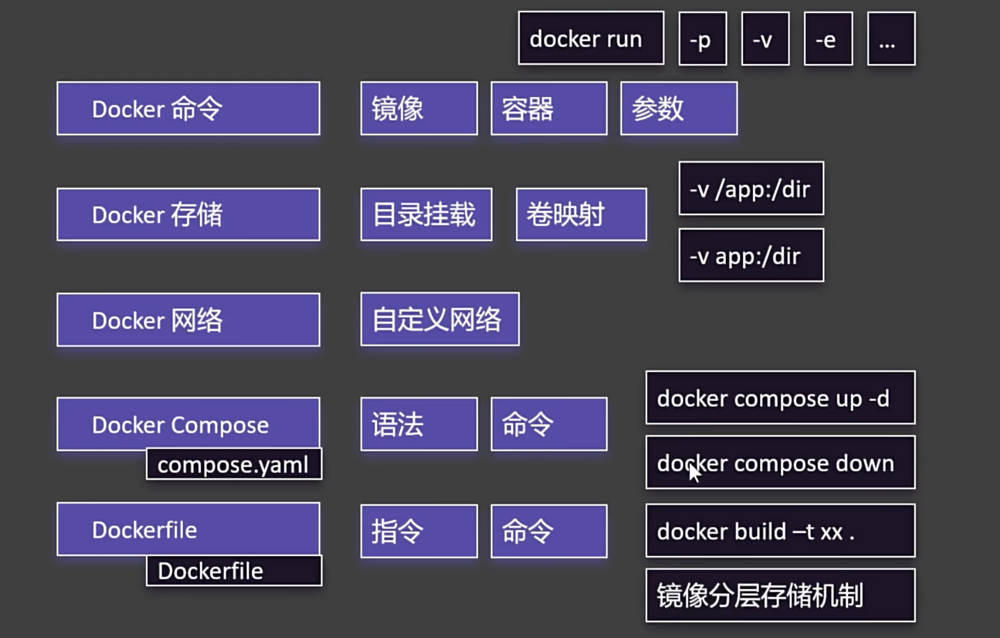

## 一、Docker 核心概念
|概念	|解释|	类比|
|---|---|---|
|镜像(Image)|	只读模板，包含运行环境和代码	|如同「软件安装包」|
|容器(Container)|	镜像的运行实例|	如同「正在运行的软件」|
|Volume(卷)	|持久化数据存储	|如同「外接硬盘」|
|Network(网络)|	容器间通信的虚拟网络	|如同「局域网」|
|docker-compose|	多容器编排工具	|如同「批量启动脚本」|


##  二、项目必备文件
1. Dockerfile（制作镜像-定义单个容器）
```
# 基础镜像
FROM node:16-alpine

# 工作目录
WORKDIR /app

# 复制依赖文件
COPY package*.json ./

# 安装依赖
RUN npm install

# 复制源码
COPY . .

# 构建（如果是TS项目）
RUN npm run build

# 暴露端口
EXPOSE 3000

# 启动命令
CMD ["npm", "run", "start:prod"]
```

2. docker-compose.yml（多容器编排）
```
version: '3.8'
services:
  app:
    build: .  # 使用当前目录的Dockerfile
    ports:
      - "3000:3000"
    volumes:
      - ./data:/app/data  # 挂载SQLite数据库
    depends_on:
      - redis
      - rabbitmq

  redis:
    image: redis:alpine
    ports:
      - "6379:6379"

  rabbitmq:
    image: rabbitmq:management
    ports:
      - "5672:5672"
      - "15672:15672"
```

3. .dockerignore（忽略文件）

```
node_modules
.git
.env
*.log
```

## 三、核心命令流程
1. 开发阶段
```
# 构建镜像（首次或代码变更时）
docker-compose build

# 启动所有服务
docker-compose up -d

# 查看日志
docker-compose logs -f app

# 进入容器调试
docker exec -it app sh
```

2. 部署阶段
```
# 停止服务
docker-compose down

# 生产环境构建（清理缓存）
docker-compose build --no-cache

# 启动服务（带重启策略）
docker-compose up -d --restart always
```

3. 维护命令

```
# 查看运行中的容器
docker ps

# 查看镜像
docker images

# 清理无用资源
docker system prune
```

## 四、关键配置详解
1. 网络互联原理
- 容器间通信：通过 service name 直接访问（如 redis://redis:6379）

- 宿主机访问：通过 ports 映射（如 - "3000:3000"）

2. 数据持久化
```yaml
volumes:
  - ./data:/app/data  # 宿主机目录:容器目录（目录挂载）
  - app:/app/data  # 卷映射 (自动填充宿主机卷为容器卷内容)
```
- SQLite 文件会保存在宿主机的 ./data 目录

- 即使容器删除，数据也不会丢失

3. 环境变量管理
```yaml
environment:
  - RABBITMQ_URI=amqp://rabbitmq:5672
```


## 一般常用命令
```
//比如
dorcker  run -d
```


## 小结
